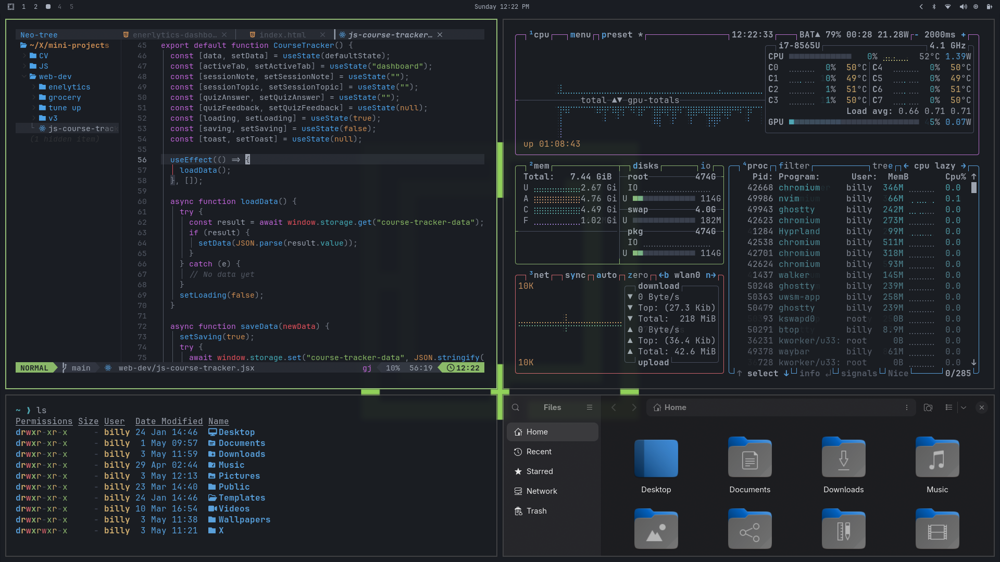

# Fern Dusk — Omarchy Theme

A dark, flat Omarchy theme built on the One Dark palette. Deep near-black backgrounds, warm grey text, and a muted green accent — calm, easy on the eyes, and quietly alive.

## Preview



Desktop wallpaper sample: [backgrounds/omarchy.png](backgrounds/omarchy.png)

### Quick Specs

| Item | Value |
|------|-------|
| Base look | One Dark-inspired, flat dark UI |
| Mood | Calm contrast, low glare, forest-tinged accents |
| Best use | Long coding sessions, terminal-heavy workflows |
| Accent family | Green-first with balanced semantic colors |
| Source of truth | `colors.toml` (auto-generates downstream styles) |

## Color Palette

### Core Tones

<table>
	<tr>
		<th>Background</th>
		<th>Surface / Selection</th>
		<th>Foreground</th>
		<th>Comment / Dimmed</th>
		<th>Accent (Green)</th>
	</tr>
	<tr>
		<td bgcolor="#1a1d23">&nbsp;&nbsp;&nbsp;&nbsp;&nbsp;&nbsp;&nbsp;&nbsp;</td>
		<td bgcolor="#3e4452">&nbsp;&nbsp;&nbsp;&nbsp;&nbsp;&nbsp;&nbsp;&nbsp;</td>
		<td bgcolor="#abb2bf">&nbsp;&nbsp;&nbsp;&nbsp;&nbsp;&nbsp;&nbsp;&nbsp;</td>
		<td bgcolor="#5c6370">&nbsp;&nbsp;&nbsp;&nbsp;&nbsp;&nbsp;&nbsp;&nbsp;</td>
		<td bgcolor="#98c379">&nbsp;&nbsp;&nbsp;&nbsp;&nbsp;&nbsp;&nbsp;&nbsp;</td>
	</tr>
	<tr>
		<td><code>#1a1d23</code></td>
		<td><code>#3e4452</code></td>
		<td><code>#abb2bf</code></td>
		<td><code>#5c6370</code></td>
		<td><code>#98c379</code></td>
	</tr>
</table>

### Semantic Accents

<table>
	<tr>
		<th>Blue</th>
		<th>Green</th>
		<th>Yellow</th>
		<th>Red</th>
		<th>Cyan</th>
	</tr>
	<tr>
		<td bgcolor="#61afef">&nbsp;&nbsp;&nbsp;&nbsp;&nbsp;&nbsp;&nbsp;&nbsp;</td>
		<td bgcolor="#98c379">&nbsp;&nbsp;&nbsp;&nbsp;&nbsp;&nbsp;&nbsp;&nbsp;</td>
		<td bgcolor="#e5c07b">&nbsp;&nbsp;&nbsp;&nbsp;&nbsp;&nbsp;&nbsp;&nbsp;</td>
		<td bgcolor="#e06c75">&nbsp;&nbsp;&nbsp;&nbsp;&nbsp;&nbsp;&nbsp;&nbsp;</td>
		<td bgcolor="#56b6c2">&nbsp;&nbsp;&nbsp;&nbsp;&nbsp;&nbsp;&nbsp;&nbsp;</td>
	</tr>
	<tr>
		<td><code>#61afef</code></td>
		<td><code>#98c379</code></td>
		<td><code>#e5c07b</code></td>
		<td><code>#e06c75</code></td>
		<td><code>#56b6c2</code></td>
	</tr>
</table>

## Installation

Install via the Omarchy installer (recommended):

```bash
omarchy-theme-install https://github.com/minhajshafin/omarchy-fern-dusk-theme
```

Or install from the Omarchy menu: Super + Alt + Space → Install → Style → Theme

After install, reload your session/theme if changes are not immediately visible.

## Included Files

| File                          | Role                                                           |
|-------------------------------|----------------------------------------------------------------|
| [colors.toml](colors.toml)    | Core — 22-color source of truth, drives auto-generated configs |
| [neovim.lua](neovim.lua)      | LazyVim spec — `navarasu/onedark.nvim` (style: darker)         |
| [btop.theme](btop.theme)      | btop gradients (green→yellow→red; cyan→green for net)          |
| [vscode.json](vscode.json)    | VS Code theme mapping                                          |
| [icons.theme](icons.theme)    | Yaru-sage icon set                                             |
| [preview.png](preview.png)    | Main README screenshot/preview image                           |
| [backgrounds/](backgrounds/)  | Wallpapers (place PNG/JPG images here)                         |

### Auto-generated Outputs

Omarchy's templating engine (v3.3.0+) auto-generates platform-specific configs from `colors.toml` at install time. You do not need to include these files in the repo:

- `ghostty.conf`, `alacritty.toml`, `kitty.conf` — terminal palettes
- `waybar.css`, `walker.css` — bar and launcher styles
- `swayosd.css` — OSD overlay
- `mako.ini` — notification colors
- `hyprlock.conf` — lock screen theme
- `chromium.theme` — browser background override

## Neovim Integration

The `neovim.lua` spec pulls in `navarasu/onedark.nvim`. LazyVim will install it automatically. To tweak the style, change `style` in `neovim.lua` to `"dark"`, `"cool"`, or `"deep"`.

## Wallpapers

Add dark, minimal wallpapers to `backgrounds/`. Images with deep blacks and subtle green or forest tones pair best with this palette.

Tip: avoid high-saturation backgrounds so UI accents stay readable and intentional.

## Contributing

Contributions welcome — open a PR to adjust colors, add wallpapers, or improve platform mappings. Please keep changes focused to `colors.toml` when possible so auto-generated outputs stay consistent.

## Credits

- Inspired by the One Dark Night Flat VSCode theme
- Layout and build follow the Omarchy v3.3+ `colors.toml` conventions
